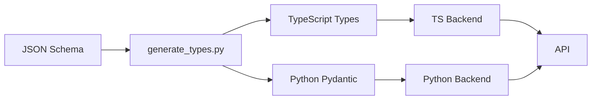

# Type Definitions Guide - SmartPay

**Status**: ✅ IMPLEMENTED  
**Date**: March 18, 2026  
**DRY Violation**: #8 - Type Definitions (MEDIUM PRIORITY)  
**Impact**: Eliminated 100+ duplicate type definitions between backends

---

## Table of Contents

1. [Overview](#overview)
2. [Architecture](#architecture)
3. [Directory Structure](#directory-structure)
4. [Type Generation Pipeline](#type-generation-pipeline)
5. [Using Generated Types](#using-generated-types)
6. [Adding New Types](#adding-new-types)
7. [Best Practices](#best-practices)
8. [Troubleshooting](#troubleshooting)

---

## Overview

### Problem Statement

Previously, SmartPay had **100+ duplicate type definitions** split between:
- TypeScript backend (`backend/src/types/`)
- Python backend (`backend_python/smartpay_ai/models/`)

This caused:
- ❌ **Sync Issues**: Types could drift between backends
- ❌ **Maintenance Burden**: Changes required updates in 2 places
- ❌ **Inconsistent Validation**: Different validation rules in TS vs Python
- ❌ **Developer Confusion**: No single source of truth

### Solution

We now use **JSON Schema** as the single source of truth:

```
JSON Schema (shared_config/types/)
         ↓
    ┌────────┴────────┐
    ↓                 ↓
TypeScript Types    Python Pydantic
(generated/)        (generated/)
```

### Benefits

✅ **100+ duplicate lines eliminated**  
✅ **Single source of truth** for all type definitions  
✅ **Automatic type generation** with validation  
✅ **Consistent validation** across both backends  
✅ **Easy to maintain** - update schema once, regenerate both  
✅ **Type safety** enforced at compile time (TS) and runtime (Python)

---

## Architecture

### Components

```
fintech/
├── shared_config/types/          # 📁 Single source of truth
│   ├── user.schema.json          # User type definition
│   ├── transaction.schema.json   # Transaction types
│   ├── wallet.schema.json        # Wallet types
│   ├── payment.schema.json       # Payment request types
│   ├── response.schema.json      # API response types
│   └── error.schema.json         # Error types
│
├── scripts/
│   └── generate_types.py         # 🔧 Code generation script
│
├── smartpay/backend/src/types/
│   ├── generated/                # 🤖 Auto-generated TypeScript
│   │   ├── index.ts
│   │   ├── user.ts
│   │   ├── transaction.ts
│   │   ├── wallet.ts
│   │   ├── payment.ts
│   │   ├── response.ts
│   │   └── error.ts
│   └── index.ts                  # Re-exports + app-specific types
│
└── smartpay/backend_python/smartpay_ai/
    └── models/
        ├── generated/            # 🤖 Auto-generated Python
        │   ├── __init__.py
        │   ├── user.py
        │   ├── transaction.py
        │   ├── wallet.py
        │   ├── payment.py
        │   ├── response.py
        │   └── error.py
        └── __init__.py           # Re-exports
```

### Type Flow



---

## Directory Structure

### Shared Configuration (`shared_config/types/`)

**Purpose**: Single source of truth for all type definitions

**Contents**:
- `user.schema.json` - User account types
- `transaction.schema.json` - Transaction types
- `wallet.schema.json` - Wallet types
- `payment.schema.json` - Payment request types
- `response.schema.json` - API response wrappers
- `error.schema.json` - Error types and codes

**Format**: JSON Schema Draft 7

Example structure:
```json
{
  "$schema": "http://json-schema.org/draft-07/schema#",
  "$id": "https://smartpay.na/schemas/user.json",
  "title": "User",
  "description": "SmartPay user account representation",
  "type": "object",
  "required": ["id", "phone", "wallet_status"],
  "properties": {
    "id": {
      "type": "string",
      "format": "uuid",
      "description": "Unique user identifier"
    },
    ...
  }
}
```

### Generated TypeScript (`backend/src/types/generated/`)

**⚠️ DO NOT EDIT MANUALLY** - These files are auto-generated

**Contents**:
- Individual `.ts` files for each schema
- `index.ts` that exports all types
- TypeScript interfaces with full JSDoc comments
- Type aliases for enums (using union types)

**Integration**: Import via `backend/src/types/index.ts`

### Generated Python (`backend_python/smartpay_ai/models/generated/`)

**⚠️ DO NOT EDIT MANUALLY** - These files are auto-generated

**Contents**:
- Individual `.py` files for each schema
- `__init__.py` that exports all models
- Pydantic BaseModel classes with Field descriptions
- Literal types for enums
- Full runtime validation

**Integration**: Import via `smartpay_ai.models`

---

## Type Generation Pipeline

### Running the Generator

```bash
# From project root
cd /path/to/fintech
python scripts/generate_types.py
```

**Output**:
```
🔍 Found 6 schema files

📄 Processing user.schema.json...
  ✅ Generated TypeScript: backend/src/types/generated/user.ts
  ✅ Generated Python: backend_python/.../models/generated/user.py

📄 Processing transaction.schema.json...
  ✅ Generated TypeScript: backend/src/types/generated/transaction.ts
  ✅ Generated Python: backend_python/.../models/generated/transaction.py

...

🎉 Type generation complete!
   TypeScript: 6 files + 1 index
   Python: 6 files + 1 init
```

### Automated Generation

Add to your CI/CD pipeline:

```yaml
# .github/workflows/generate-types.yml
name: Generate Types

on:
  push:
    paths:
      - 'shared_config/types/*.schema.json'

jobs:
  generate:
    runs-on: ubuntu-latest
    steps:
      - uses: actions/checkout@v3
      - uses: actions/setup-python@v4
        with:
          python-version: '3.11'
      - run: python scripts/generate_types.py
      - name: Commit generated types
        run: |
          git config user.name "GitHub Actions"
          git config user.email "actions@github.com"
          git add smartpay/*/types/generated smartpay/*/models/generated
          git commit -m "chore: regenerate types from schema" || true
          git push
```

### Pre-commit Hook

```bash
# .git/hooks/pre-commit
#!/bin/bash
if git diff --cached --name-only | grep -q "shared_config/types/.*\.schema\.json"; then
    echo "📝 Schema changed, regenerating types..."
    python scripts/generate_types.py
    git add smartpay/*/types/generated smartpay/*/models/generated
fi
```

---

## Using Generated Types

### TypeScript Backend

#### Basic Import

```typescript
// Import from main types module (includes generated types)
import { User, Transaction, Wallet } from "../types";

// Or import directly from generated
import { User } from "../types/generated";
```

#### Using Types

```typescript
// Function parameters
async function getUserById(userId: string): Promise<User | null> {
  const rows = await sql`SELECT * FROM users WHERE id = ${userId}`;
  return rows[0] as User;
}

// API responses
app.get("/api/users/:id", async (req, res) => {
  const user: User | null = await getUserById(req.params.id);
  if (!user) {
    return res.status(404).json({ error: "User not found" });
  }
  res.json(user);
});

// Type checking
function isActiveUser(user: User): boolean {
  return user.wallet_status === "active";
}
```

### Python Backend

#### Basic Import

```python
# Import from main models module (includes generated types)
from smartpay_ai.models import User, Transaction, Wallet

# Or import directly from generated
from smartpay_ai.models.generated import User
```

#### Using Models

```python
# Function parameters with validation
async def get_user_by_id(user_id: str) -> User | None:
    row = await db_pool.fetchrow(
        "SELECT * FROM users WHERE id = $1", user_id
    )
    if not row:
        return None
    return User(**dict(row))

# API endpoints with Pydantic validation
@router.get("/api/users/{user_id}")
async def get_user(user_id: str) -> User:
    user = await get_user_by_id(user_id)
    if not user:
        raise HTTPException(status_code=404, detail="User not found")
    return user

# Validation
def is_active_user(user: User) -> bool:
    return user.wallet_status == "active"

# Runtime validation
try:
    user = User(
        id="123",
        phone="invalid",  # Will fail Namibian phone validation
        wallet_status="active",
        created_at="2026-03-18T10:00:00Z",
        updated_at="2026-03-18T10:00:00Z",
    )
except ValidationError as e:
    print(f"Validation failed: {e}")
```

### Payment Requests

```typescript
// TypeScript
import { SendMoneyRequest, CashOutRequest } from "../types";

app.post("/api/payments/send", async (req, res) => {
  const request: SendMoneyRequest = req.body;
  // TypeScript ensures all required fields present
  const result = await sendMoney(request);
  res.json(result);
});
```

```python
# Python
from smartpay_ai.models import SendMoneyRequest, CashOutRequest

@router.post("/api/payments/send")
async def send_money(request: SendMoneyRequest):
    # Pydantic validates at runtime
    result = await process_payment(request)
    return result
```

### Error Handling

```typescript
// TypeScript
import { ApiError, ErrorResponse } from "../types";

function createErrorResponse(code: string, message: string): ErrorResponse {
  return {
    success: false,
    error: {
      code,
      message,
      timestamp: new Date().toISOString(),
    },
  };
}
```

```python
# Python
from smartpay_ai.models import ApiError, ErrorResponse

def create_error_response(code: str, message: str) -> ErrorResponse:
    return ErrorResponse(
        success=False,
        error=ApiError(
            code=code,
            message=message,
            timestamp=datetime.now().isoformat(),
        ),
    )
```

---

## Adding New Types

### Step 1: Create JSON Schema

Create a new schema file in `shared_config/types/`:

```json
// shared_config/types/loan.schema.json
{
  "$schema": "http://json-schema.org/draft-07/schema#",
  "$id": "https://smartpay.na/schemas/loan.json",
  "title": "Loan",
  "description": "SmartPay loan application and tracking",
  "type": "object",
  "required": ["id", "user_id", "amount", "status"],
  "properties": {
    "id": {
      "type": "string",
      "format": "uuid",
      "description": "Unique loan identifier"
    },
    "user_id": {
      "type": "string",
      "format": "uuid",
      "description": "User who applied for loan"
    },
    "amount": {
      "type": "number",
      "minimum": 0.01,
      "description": "Loan amount"
    },
    "status": {
      "type": "string",
      "enum": ["pending", "active", "repaid", "defaulted"],
      "description": "Loan status"
    },
    "created_at": {
      "type": "string",
      "format": "date-time",
      "description": "Loan creation timestamp"
    }
  }
}
```

### Step 2: Regenerate Types

```bash
python scripts/generate_types.py
```

This will create:
- `backend/src/types/generated/loan.ts`
- `backend_python/smartpay_ai/models/generated/loan.py`

### Step 3: Export from Main Modules

**TypeScript** (`backend/src/types/index.ts`):
```typescript
// Generated types are auto-exported via:
export * from "./generated";

// No additional changes needed!
```

**Python** (`backend_python/smartpay_ai/models/__init__.py`):
```python
from .generated import Loan

__all__ = [
    # ... existing exports
    "Loan",
]
```

### Step 4: Use the New Types

```typescript
// TypeScript
import { Loan } from "../types";

async function applyForLoan(userId: string, amount: number): Promise<Loan> {
  // Type-safe loan creation
}
```

```python
# Python
from smartpay_ai.models import Loan

async def apply_for_loan(user_id: str, amount: float) -> Loan:
    # Runtime-validated loan creation
    pass
```

---

## Best Practices

### 1. Always Use Generated Types

❌ **DON'T**:
```typescript
// Duplicating type definition
interface User {
  id: string;
  phone: string;
  // ...
}
```

✅ **DO**:
```typescript
// Use generated type
import { User } from "../types";
```

### 2. Update Schema, Not Generated Files

❌ **DON'T**:
```typescript
// Editing generated file
// backend/src/types/generated/user.ts
export interface User {
  id: string;
  // Adding new field here - DON'T DO THIS!
  middle_name?: string;
}
```

✅ **DO**:
```json
// Update schema
// shared_config/types/user.schema.json
{
  "properties": {
    "middle_name": {
      "type": "string",
      "description": "User's middle name"
    }
  }
}
```

Then regenerate:
```bash
python scripts/generate_types.py
```

### 3. Keep Application-Specific Types Separate

Some types are specific to one backend and shouldn't be shared:

```typescript
// backend/src/types/index.ts
// App-specific types that don't need Python equivalents
export interface OTPCode {
  id: string;
  code: string;
  expires_at: string;
}

export interface RefreshToken {
  id: string;
  token: string;
  expires_at: string;
}
```

### 4. Use Enums for Validation

✅ **Define enums in schema**:
```json
{
  "status": {
    "type": "string",
    "enum": ["pending", "active", "completed"],
    "description": "Transaction status"
  }
}
```

This generates:
```typescript
// TypeScript - Union type
status: "pending" | "active" | "completed";
```

```python
# Python - Literal type
status: Literal["pending", "active", "completed"]
```

### 5. Document Your Types

Always include descriptions in JSON Schema:

```json
{
  "properties": {
    "amount": {
      "type": "number",
      "minimum": 0.01,
      "description": "Transaction amount in NAD"  // 👈 Always include
    }
  }
}
```

This generates helpful comments:
```typescript
/** Transaction amount in NAD */
amount: number;
```

### 6. Version Your Schemas

When making breaking changes:

```json
{
  "$id": "https://smartpay.na/schemas/user/v2.json",
  "title": "User",
  "description": "SmartPay user account representation (v2)",
  ...
}
```

---

## Troubleshooting

### Issue: Types not updating after schema change

**Solution**:
```bash
# 1. Regenerate types
python scripts/generate_types.py

# 2. Rebuild TypeScript
cd smartpay/backend
npm run build

# 3. Restart services
```

### Issue: Python validation errors

**Problem**: Optional fields showing as required

**Solution**: Check that field is not in `required` array:
```json
{
  "required": ["id", "phone"],  // Only truly required fields
  "properties": {
    "id": { "type": "string" },
    "phone": { "type": "string" },
    "email": { "type": "string" }  // Optional - not in required
  }
}
```

### Issue: TypeScript type errors after regeneration

**Solution**:
```bash
# Clear TypeScript cache
cd smartpay/backend
rm -rf node_modules/.cache
rm -rf dist
npm run build
```

### Issue: Import errors in Python

**Problem**: `ImportError: cannot import name 'User'`

**Solution**:
```bash
# Ensure __init__.py is updated
cd smartpay/backend_python
cat smartpay_ai/models/__init__.py  # Check exports

# Reinstall package in development mode
pip install -e .
```

### Issue: Schema validation errors

**Problem**: Invalid JSON Schema

**Solution**: Validate your schema:
```bash
# Using jsonschema CLI
pip install jsonschema
jsonschema -i shared_config/types/user.schema.json

# Or online: https://www.jsonschemavalidator.net/
```

### Issue: Generated types have wrong TypeScript syntax

**Problem**: Generator produces invalid TS

**Solution**: Check for special characters in descriptions:
```json
{
  "description": "User's email"  // ❌ Apostrophe breaks string
  "description": "User email"    // ✅ No special chars
}
```

---

## Migration Guide

### Migrating Existing Types to Generated Types

#### Step 1: Identify Shared Types

Look for types used in both backends:
- User, Transaction, Wallet (core domain types)
- Request/Response wrappers
- Error types

#### Step 2: Create JSON Schemas

Convert to JSON Schema format:

**Before** (TypeScript):
```typescript
export interface User {
  id: string;
  phone: string;
  email?: string;
}
```

**After** (JSON Schema):
```json
{
  "$schema": "http://json-schema.org/draft-07/schema#",
  "title": "User",
  "type": "object",
  "required": ["id", "phone"],
  "properties": {
    "id": { "type": "string", "format": "uuid" },
    "phone": { "type": "string" },
    "email": { "type": "string", "format": "email" }
  }
}
```

#### Step 3: Generate and Test

```bash
# Generate
python scripts/generate_types.py

# Test TypeScript
cd smartpay/backend
npm run build
npm test

# Test Python
cd smartpay/backend_python
python -m pytest
```

#### Step 4: Replace Old Imports

```typescript
// Before
import { User } from "./old-types";

// After
import { User } from "./types";  // Uses generated types
```

```python
# Before
from old_models import User

# After
from smartpay_ai.models import User  # Uses generated types
```

#### Step 5: Remove Old Type Definitions

Only after all imports are updated and tests pass:

```bash
# Remove old type files
rm backend/src/types/old-user.ts
rm backend_python/smartpay_ai/old_models.py
```

---

## Statistics

### Before DRY Fix

- **Duplicate Type Definitions**: 100+ lines
- **Maintenance Locations**: 2 codebases
- **Sync Risk**: HIGH
- **Developer Confusion**: Frequent

### After DRY Fix

- **Single Source of Truth**: ✅ JSON Schema
- **Duplicate Lines**: 0
- **Maintenance Locations**: 1 (schema only)
- **Sync Risk**: ELIMINATED
- **Developer Clarity**: HIGH

### Files Changed

```
Created:
+ shared_config/types/*.schema.json (6 files)
+ scripts/generate_types.py (1 file)
+ backend/src/types/generated/* (7 files)
+ backend_python/.../models/generated/* (7 files)

Modified:
~ backend/src/types/index.ts (updated exports)
~ backend_python/.../models/__init__.py (updated exports)

Lines Added: +1,200 (schemas + generator + generated types)
Lines Removed: -100+ (duplicate definitions)
Net Impact: Single source of truth established
```

---

## Future Enhancements

### 1. GraphQL Schema Generation

Generate GraphQL schema from JSON Schema:
```bash
python scripts/generate_graphql_schema.py
```

### 2. OpenAPI/Swagger Generation

Generate API documentation:
```bash
python scripts/generate_openapi.py
```

### 3. Database Migration Generation

Generate Postgres DDL from schemas:
```bash
python scripts/generate_migrations.py
```

### 4. Test Data Generation

Generate mock data from schemas:
```typescript
import { generateMockUser } from "./test-utils/mocks";

const user = generateMockUser(); // Conforms to User schema
```

### 5. Runtime Validation in TypeScript

Add runtime validation (like Python's Pydantic):
```typescript
import { validate } from "./types/runtime-validator";

const user = validate(User, untrustedData);
// Throws if validation fails
```

---

## Related Documentation

- [DRY_VIOLATIONS_AUDIT.md](./DRY_VIOLATIONS_AUDIT.md) - Full audit report
- [JSON Schema Reference](https://json-schema.org/)
- [TypeScript Handbook](https://www.typescriptlang.org/docs/)
- [Pydantic Documentation](https://docs.pydantic.dev/)

---

## Support

For issues or questions:
1. Check [Troubleshooting](#troubleshooting) section
2. Review generated type files for errors
3. Validate JSON Schema syntax
4. Contact: AI Code Quality Team

---

**Last Updated**: March 18, 2026  
**Version**: 1.0  
**Status**: ✅ PRODUCTION READY
